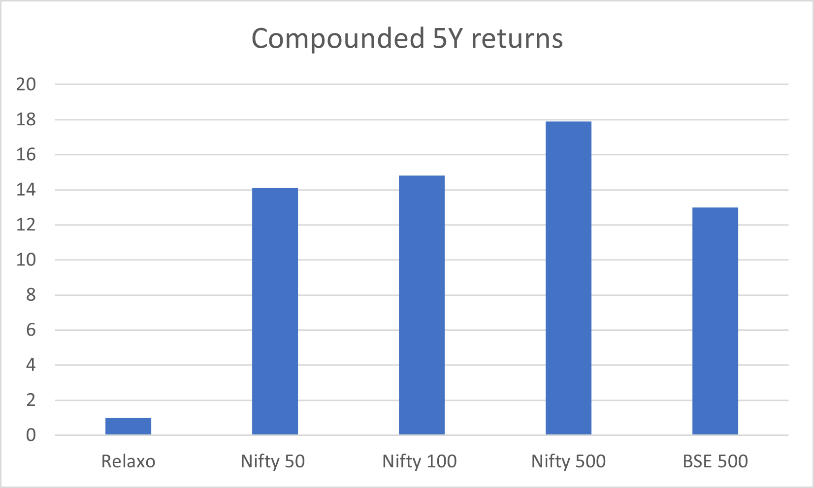
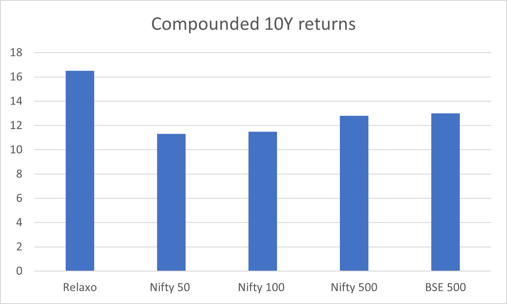
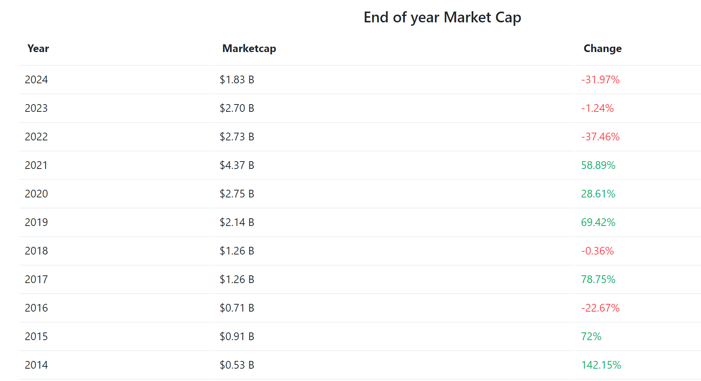
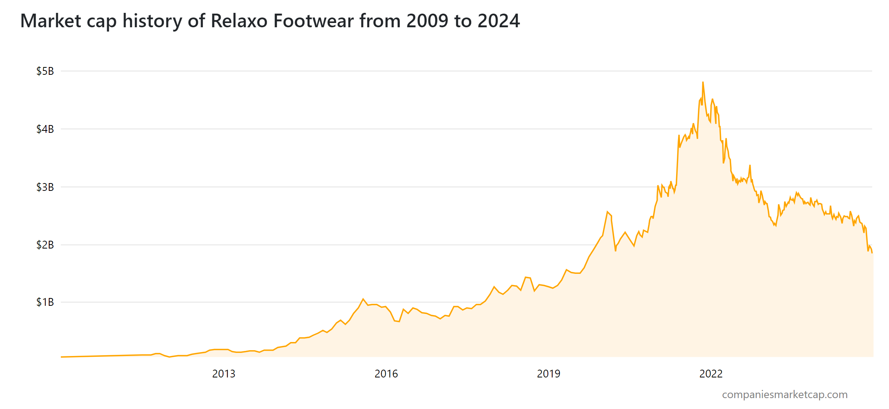
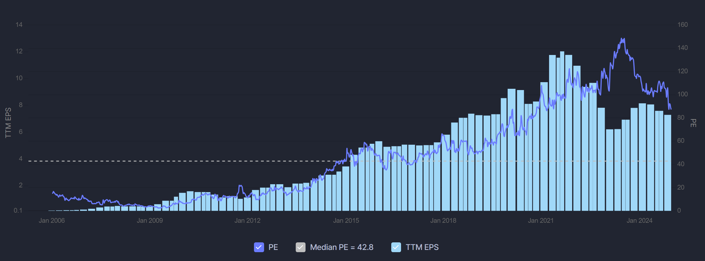
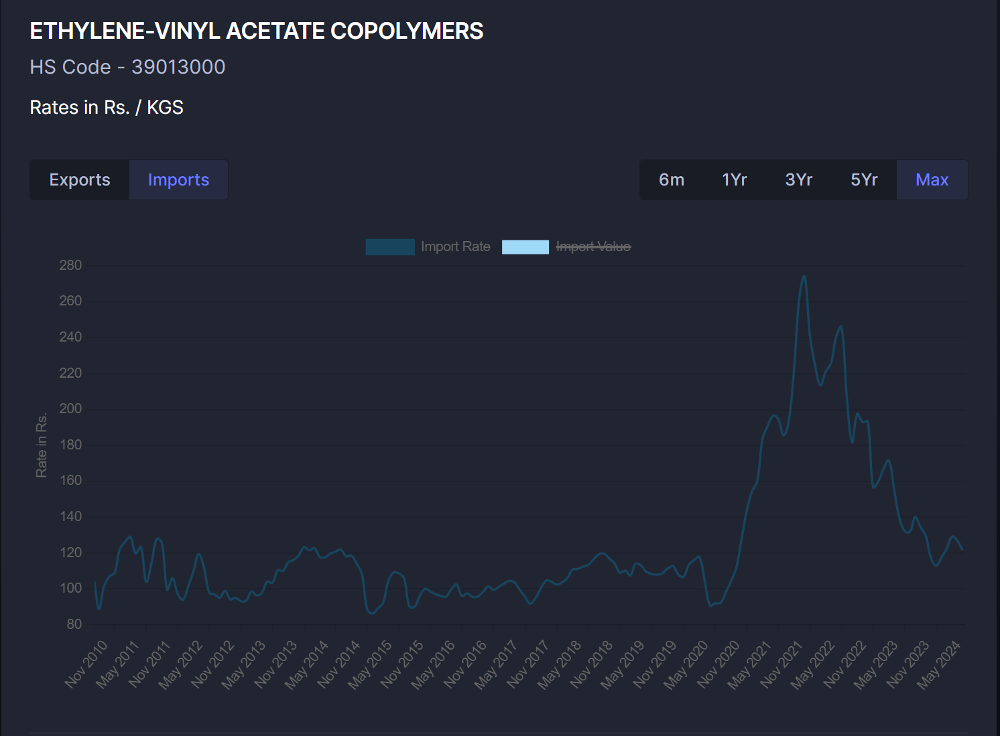

19/12/2024 ; 12:31

---

Links : [Sanjay Bakshi](../People/Sanjay%20Bakshi.md)  , [Ravi Purohit](../People/Ravi%20Purohit.md)  
[Relaxo Footwears Ltd](../Stocks/Relaxo%20Footwears%20Ltd.md)  , [Leather](../Sectors/Leather.md)  , [Masterclass with Super-Investors](../Sources/Books/Masterclass%20with%20Super-Investors.md)  , [Rajashekar Iyer](../People/Rajashekar%20Iyer.md)   

Document : Relaxo_Cinderella.pdf

> "In an earlier mail, I had asked all of you to read up the annual reports of the company for the last 10 years."

Group 1:

> 1. How has the company's stock done over the last 5 and 10 years in absolute terms and as compared to the market?

1. Past 5 year performance (*values in %*)

|            |  Relaxo  | Nifty 50 | Nifty 100 | Nifty 500 | BSE 500 |
| ---------- | :------: | :------: | :-------: | :-------: | :-----: |
| Absolute   | **2.37** |  95.18   |  101.28   |   129.7   | 127.55  |
| Compounded |  **1**   |   14.1   |   14.8    |   17.9    |  13.0   |

* Relaxo, over the past *5 years*, has not given almost no return both in absolute and in comparison to the market

2. Past 10 year performance (*values in %*)

|            |  Relaxo  | Nifty 50 | Nifty 100 | Nifty 500 | BSE 500 |
| ---------- | :------: | :------: | :-------: | :-------: | :-----: |
| Absolute   |   364    |  188.5   |    200    |    230    |   237   |
| Compounded | **16.5** |   11.3   |   11.5    |   12.8    |   13    |

* Relaxo, over the past *10 years*, has outperformed the index by ~3-5 % CAGR

> How has the company's market cap changed over the last 10 years? 

* The MarketCap of the company, has steadily risen up until about late 2021, after which it has been on a decline

Why did this occur? 

EPS over the years (*bars in the following fig.*)

 * Around the late 2021 period, there has been a sharp decline in the *EPS* of the company 

| Sales      | Sep 21 | Dec 21 | Mar 22 | Jun 22 | Sep 22 | Dec 22 | Mar 23 |
| ---------- | ------ | ------ | ------ | ------ | ------ | ------ | ------ |
| Sales      | 714    | 744    | *698*  | *667*  | *670*  | *681*  | 765    |
| OPM        | 16%    | 16%    | *16%*    | *13%*    | *9%*     | *11%*    | 15%    |
| Op Profit  | 117    | 122    | 111    | 86     | 59     | 72     | 118    |
| Net Profit | 69     | 70     | 63     | 39     | 22     | 30     | 63     |

 * Why did the earnings drop sharply in the period following it?  
	AR 2021-2022(pg 10):
		1. Raw materical price increase - caused margins to tank
		What is Relaxo's raw material? 
		They make 👟 so : 
		Ethylene-Viny Acetate
		
		Sharp increase in price in late 2021 and into 2022
		2. Covid related : 
			1. Disruptions in supply chain due to lockdown and global logistics issues
			2. Subdued consumer demand
		3. Change in GST rate impacted margins

> 3. How has the company performed on Buffett's earnings retention test?  

Buffett's earnings retention test : 
Period 2014 - 2024
1. 
$$
\sum_{2015}^{2024} Net \space Profit = 1784\space cr
$$

2. 
$$
\sum_{2015}^{2024} Dividends \space Paid = 357 \space cr
$$

3. 
$$
Retained \space Earnings \space (ER) = 1784 - 357 =1427\space cr
$$

4. 
$$
\Delta Market \space Cap \space (MC) = \$1.83B - \$0.53B =\$1.4B= \space 11,895 \space cr
$$

5. 
$$
\frac{\Delta MC}{ER}=\frac{11,895}{1427}=8.33
$$

Thus for every ₹1 earned and retained, ₹8.33 increase in market cap

Group 2 : 

